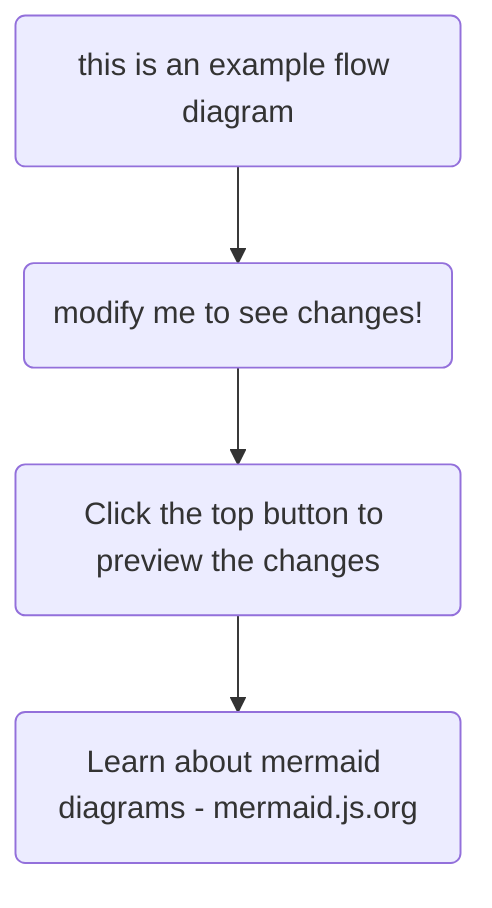

huhuhuhuhuhuh

This is the landing page.

## Explore

{{\< cards >}}
{{\< card link="docs" title="Docs" icon="book-open" >}}
{{\< card link="about" title="About" icon="user" >}}
{{\< /cards >}}
awfafeeeeeeeeeeeeeeeeeeeeeeeeeeeee
liuygkuyg
testing


[aweffa](https://google.com/)


> WEFAWEF\
> \\

* AWEFAWEF
* AWEFAWEF

AWEFAWEF

1. EWAFW
2. AWEFAWEW
3. BAERGAER
4. GETR

**fawefawef**

~~awfawefawef~~

*awefawefawef*

`gfawefawefawef ccoangfaoer. awegjhaiweogf`

`awjeifjawoefijawoef`

`awejfioawjefioawefaw'efjiawe`

`fjaw`

`efja`

`weifja`

`we`

```javascript
undefinedawefioawhef
ja[weifjawiuefh
; aouwheiuawhefaiwe
aiwuhefiauowhef

]
```



| iouh | uiygh | ouyg  |
| ---- | ----- | ----- |
| yug  | iuy   | giuyg |

## Documentation

For more information, visit [Hextra](https://imfing.github.io/hextra).
